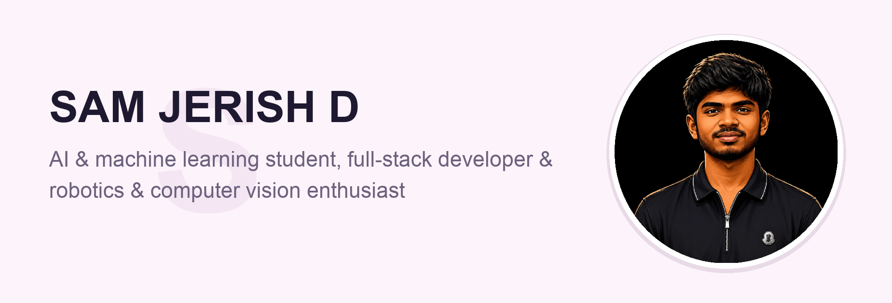

# Hi, I'm Sam Jerish 👋 💻

  

 

I'm an **AI & Machine Learning Student** and **Full-Stack Developer** passionate about Artificial Intelligence, Autonomous Robotics, Computer Vision, and turning innovative ideas into real-world solutions. 🚀

---

## 📈 Contribution Activity

  <!-- GitHub Streak Stats (Black & White Theme) -->
  
    

  <!-- GitHub Stats & Top Languages (Black & White Theme) -->
  <table border="0" cellpadding="0" cellspacing="4">
    <tr>
      <td align="center" valign="middle">
        
      </td>
      <td align="center" valign="middle">
        
      </td>
    </tr>
  </table>

   

  <!-- Live Contribution Heatmap Graph (Monochrome / B&W) -->
  
<b>Live Contribution Heatmap:</b>

  

---

## 🌐 Connect with me

  <!-- Action Buttons -->
  

    
    &nbsp;
    
    &nbsp;
    
    &nbsp;
    
  

  <!-- Fallback Badge Links -->
  

    
    &nbsp;
    
    &nbsp;
    
    &nbsp;
    
  

   

  

